# Projectweek 2 - Solve, Debug & Optimize website


Met dit project wil ik laten zien hoe de performance en toegankelijkheid van de website Part-up verbeterd kan worden.
##### [part-up.com](part-up.com)  |  Alle testen zijn gedaan op 


[](IMG/screenshot.png)
[](IMG/timeline1.png)


## Knoppen

`<a>` vs. `<buttons>`

Als een link in de website naar een nieuwe tab verwijst moet er gebruik gemaakt worden van het `<a>` element en als de link naar een element binnen de pagina verwijst dient er gebruik gemaakt te worden van het `<button>` element.

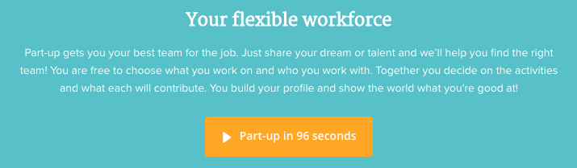

Hier is het een ```<button>```

-

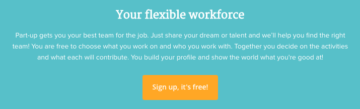

Hier is het een ```<a>```

## Outline

`outline: none` zorgt ervoor dat de focus niet gezien kan worden zodra er door de website heen getabed wordt. Er zijn mensen die hun muis niet gebruiken en in plaats daarvan alleen gebruik maken van hen toetsenbord. Voor deze mensen zou het erg prettig zijn dat zij kunnen zien waar zij zich in de website bevinden. 


## Images

Door middel van de images te verkleinen hoeft er minder ingeladen te worden waardoor de website sneller wordt. Met een tooltje heb ik zelf de images geoptimaliseerd maar ik zou adviseren om dit te automatiseren met Gulp.

> Saved 573,7KB out of 2,2MB. 45,7% per file on average 
browsers

Alle plaatjes die worden ingeladen op de homepagina duurde totaal: **4131 ms** 
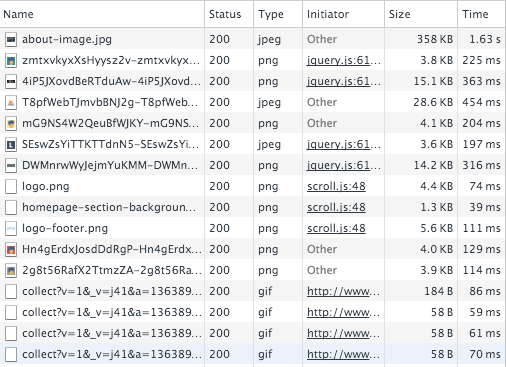

Nadat de plaatjes geoptimaliseerd waren duurde het: **2342 ms** 
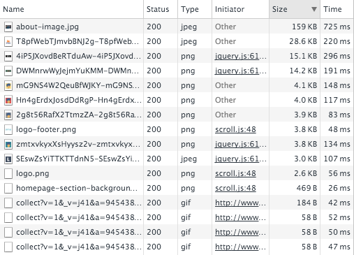


|Images verkleinen|	Voor	         | Na          | Verschil  |
|----| ------------- |---------------|-------|
|Laadtijd| 4131 ms      | 2341 ms | 1789 ms|


## Srcset

Op kleine schermen worden dezelde images ingeladen als op grote schermen terwijl kleine schermen helemaal niet zn grote resolutie nodig hebben. Met het srcset attribute kun je er voor zorgen dat de browser het juiste formaat plaatje bij een bepaalde afmeting neerzet. Op deze manier voorkom je dat er op een mobile device een plaatje van 1300 px wordt ingeladen.

```

```


Zonder srcset getest op een iPhone 5

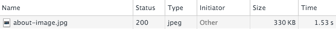

-

Met srcset getest op een iPhone 5

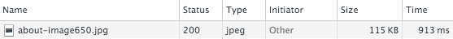

## Kleuren

Het is belangrijk om te zorgen voor een hoog contrast zodat ook minder goed ziende mensen alles goed kunnen lezen.


Het contrast van dit element op de website is erg slecht. Ook kwam dit uit de test [Contrast Ratio van Lea Verou](http://leaverou.github.io/contrast-ratio/#%23cacaca-on-%23f9f9f9).

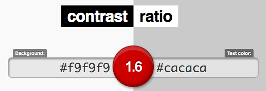


Uit de test komt een **1.6** waar de hoogste score **21** is.
Voor slechtziende mensen is deze tekst niet te lezen. Mijn advies is om te kiezen voor een hoger contrast.


## Responsive
De homepage van de website is responsive. De rest van de pagina's zijn **niet** responsive. Mijn advies is om alle pagina's responsive te maken zodat gebruikers op kleinere schermen ook goed gebruik kunnen maken van de website en niet horizontaal moeten scrollen.


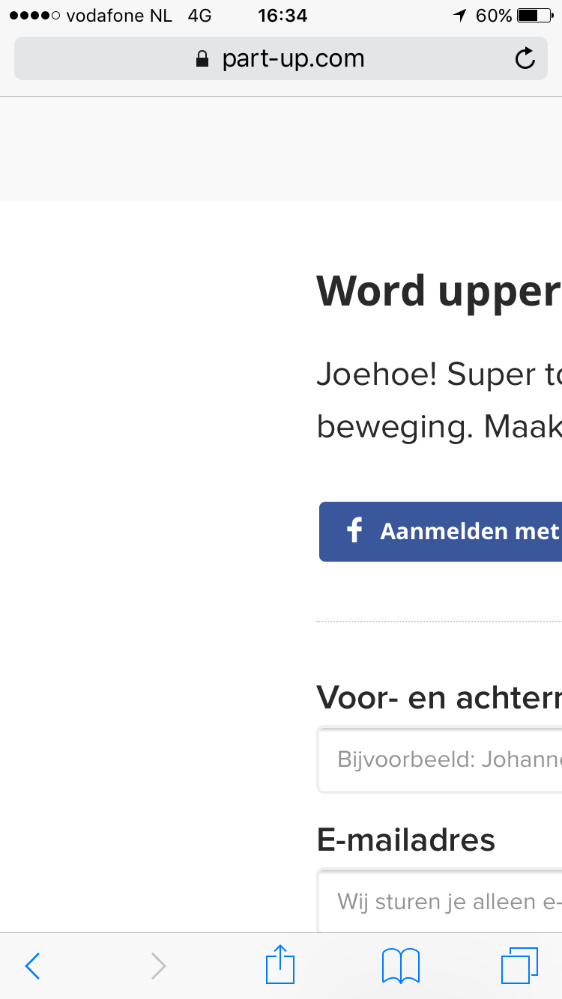
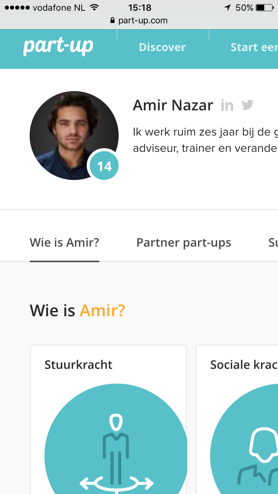


## Cursor
Een cursor verteld wat de gebruiker met bepaalde elementen wel en niet kan doen. Zodra er een handje verschijnt weet de gebruiker dat hij kan klikken. Op het onderstaande element is een `:hover` en een `cursor:pointer` toegepast terwijl het element helemaal niet klikbaar is. Op deze manier wekt het wel de intentie om er op te gaan klikken waardoor er verwarring ontstaat.

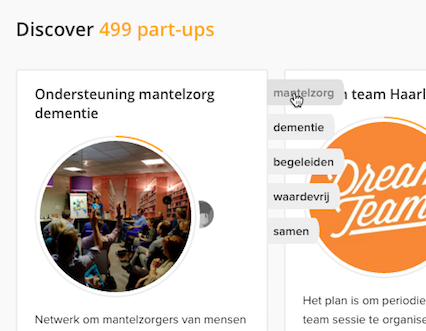

-

Onderstaand element is opgemaakt als een `<a>` element terwijl het logo nergens heen verwijst `href="#"`


## Critical css

Er kan performance winst behaald worden door middel van critical css. De gebruiker zal eerder 'iets' te zien krijgen op de website waardoor de gebruiker ziet dat er 'iets' gebeurd en niet op niets zit te wachten. Op deze manier zal de gebruiker minder snel geneigd zijn om de website te verlaten als het laden lang duurt. 

**Zonder critical css**
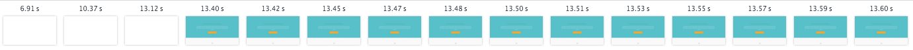

-
**Met critical css**
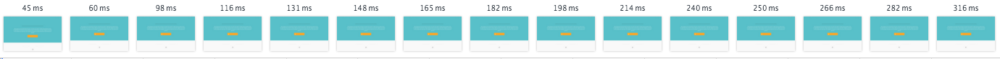


``` 
<head>
	<style>.pu-header{min-width:320px;position:relative;z-index:5}.pu-header .pu-sub-mobilebar{background-color:#57c0c9;}.pu-header .pu-sub-logo{text-align:center}.pu-header .pu-sub-logo h1 span{display:none}.pu-header .pu-sub-logo .pu-brand{display:inline-block;margin-top:17px;margin-bottom:5px}.pu-header .pu-sub-nav{float:left;margin-left:10px}.pu-header .pu-sub-personal{float:right;margin-right:10px}.pu-header-desktop{background-color:#57c0c9;height:60px}.pu-header-desktop .pu-sub-mobilebar{background-color:transparent;border-bottom:none}.pu-header-desktop .pu-sub-logo{float:left;width:157px}.pu-header-desktop .pu-sub-nav{float:left;margin-left:0}.pu-header-desktop .pu-sub-personal{float:right;margin-right:0}.pu-header-modal{background-color:#f9f9f9;text-align:center;height:70px}.pu-header-modal.pu-header-progress .pu-progresspager{padding-top:70px;top:0}.pu-header-progress{font-family:"open-sans", sans-serif;font-size:15px;font-weight:600;position:relative}.pu-header-progress .pu-progresspager{position:absolute;top:100%;left:50%;-webkit-transform:translateX(-50%);-ms-transform:translateX(-50%);transform:translateX(-50%);margin-top:-1px;z-index:1}.pu-header-progress .pu-button{margin-top:9px}@media screen and (min-width: 992px){.pu-header{background-color:#57c0c9;height:60px}</style>
</head>
```